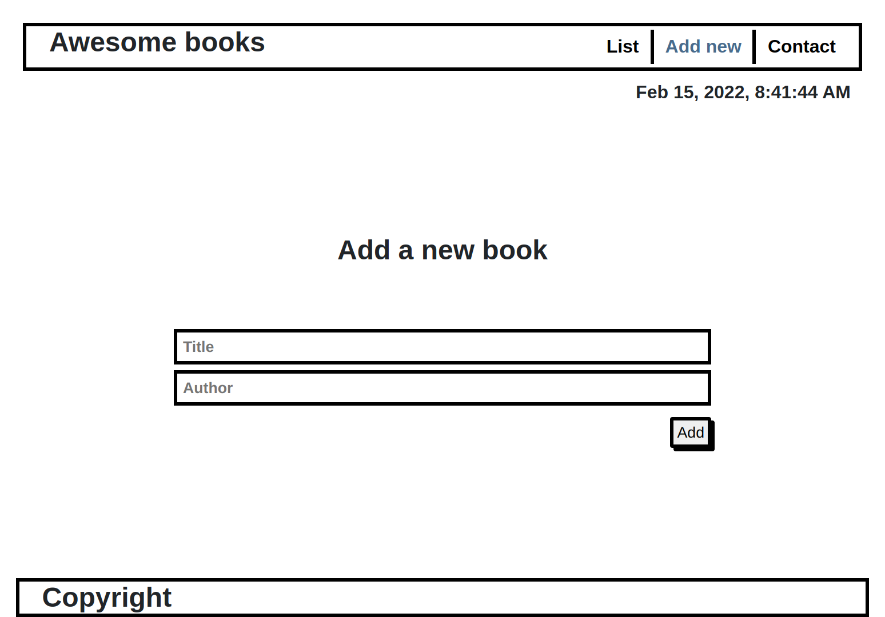

# Awesome Books With ES6

> Creating an app that adds and delete books from a list.

  

## Built With

- HTML
- CSS
- JavaScript

## Application Page url

- [Live Demo Link](https://cynthiainga.github.io/Awesome-books-with-ES6/)

## Getting Started

> To get a local copy follow the following steps:

- Copy this link https://github.com/cynthiainga/Awesome-books-with-ES6.git
- Open your terminal or command line
- Run git clone and paste the link
- Open the folder with your code editor

## Author

👤 **Cynthia Inga Candy**

- GitHub: [@cynthiainga](https://github.com/cynthiainga)
- Twitter: [@CynthiaInga_C](https://twitter.com/CynthiaInga_C)
- LinkedIn: [Cynthia Inga](https://www.linkedin.com/in/cynthia-inga/)

## 🤝 Contributing

Contributions, issues, and feature requests are welcome!

Feel free to check the issue page

## Show your support

Give a ⭐️ if you like this project!

## Acknowledgments

- Hat tip to anyone whose code was used
- Inspiration
- etc

## 📝 License

This project is [MIT](./MIT.md) licensed.
